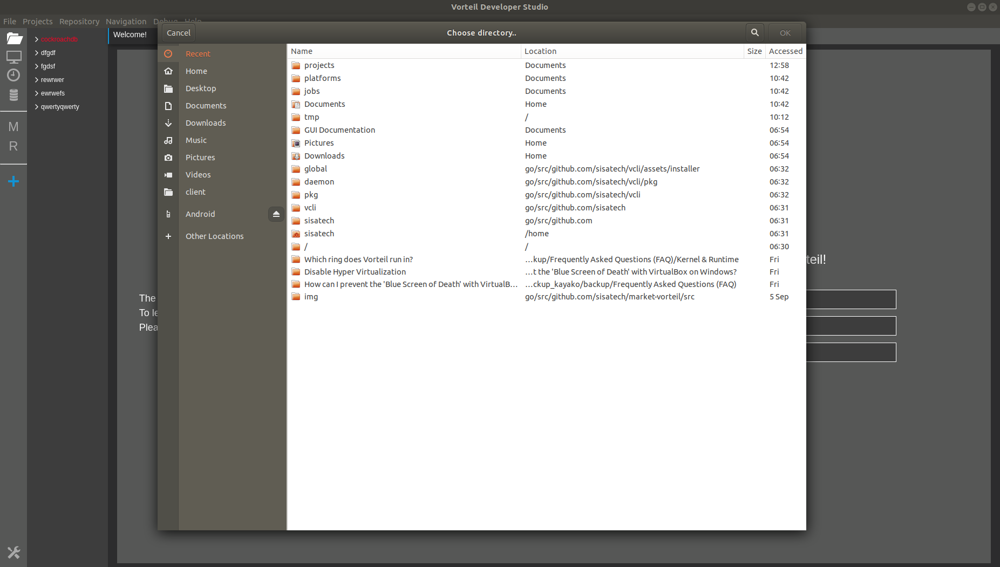

# Creating a new project

To create a new project on the Studio. Its as simple as finding the "Projects" context and clicking on New Project. A dialog box should appear asking where you would like to save the project. You are able to make folders in this window. An example of the dialog box is shown below.

Upon choosing your directory to save the project the tree list should update with another item. Naming it appropriately according to where it was saved on the disk.
